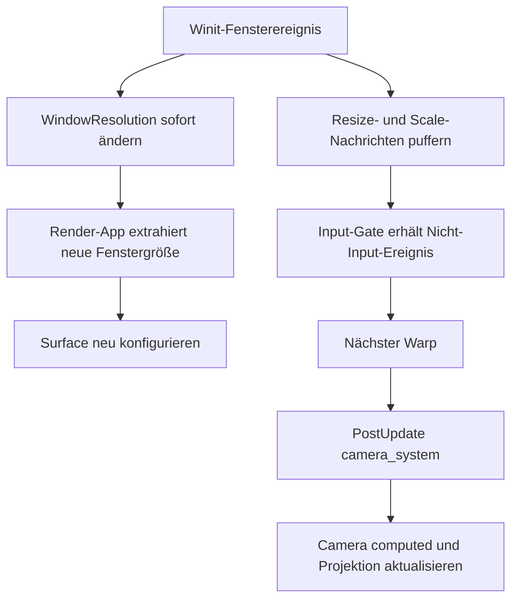

# Fenster, Schedules und schwarze Screenshots

## Kurzurteil

Die Größenänderung ist eine echte Schedule-Naht, aber nach den vorhandenen
Artefakten keine ausreichende Erklärung für RGB0. Im kontrollierten Leerlauf
läuft Bevys `camera_system` nicht. Winit aktualisiert `Window` bei Resize und
Skalierungswechsel trotzdem sofort, und die Render-App konfiguriert die Surface
auf diese neue Größe. `Camera::computed`, Projektion und ein expliziter Viewport
bleiben dagegen bis zum nächsten Warp auf dem alten Stand.

Die stärkere Fehlerkette liegt zwischen Surface-Akquise und Screenshot-Copy.
Auf macOS gibt wgpu 29.0.4 für ein nach `NSWindow.occlusionState` nicht
sichtbares Fenster `Occluded` zurück. Bevy 0.19.1 erhält dann keinen
Swapchain-View. Die Screenshot-Vorbereitung legt dennoch eine eigene
Rendertextur und einen Readback-Buffer an. Beim späteren Submit prüft Bevy aber
zuerst den Swapchain-View und überspringt ohne ihn die gesamte Funktion,
einschließlich `copy_texture_to_buffer`. Anschließend liest Bevy den
vorbereiteten Buffer trotzdem aus und meldet einen fertigen Screenshot. Diese
Quellenkette kann einen gültigen, vollständig schwarzen PNG-Erfolg erzeugen,
obwohl zuvor beliebig viele Simulationsticks gelaufen sind.

Das ist noch kein Live-Nachweis für einen der beobachteten Läufe. Der
entscheidende Wert, das Ergebnis von `get_current_texture()` im schwarzen
Frame, wurde dort nicht protokolliert.

## Abgrenzung der Nachweise

### Reproduziert

- In diesem Worker wurde kein schwarzer Screenshot reproduziert. Die
  angeordnete GPU- und Fensterexklusivität schließt den dafür nötigen
  Metal/Winit-Lauf aus.
- Der vorhandene headless Test
  `session::plugin::tests::idle_control_drains_render_clock_without_advancing_time`
  besteht. Er bestätigt, dass Leerlauf-Updates den Render-Zeitkanal leeren,
  ohne `Time<Real>` fortzuschreiben.
- Der vorhandene headless Test
  `session::plugin::input_tests::independent_virtual_devices_ignore_native_input_without_window_focus`
  besteht. Er bestätigt, dass das Input-Gate native Eingaben verwirft, ein
  `WindowResized` im Sammel-`WindowEvent` aber bis zum Warp erhält und genau
  einmal an die Simulation gibt.
- Die statische Probe
  [`tests/diagnostics/window_schedules.py`](../../../tests/diagnostics/window_schedules.py)
  besteht gegen die tatsächlich gelockten Quellen. Sie prüft die
  Schedule-Auslagerung, Bevys `camera_system` in `PostUpdate`, den
  `Occluded`-Zweig, die Swapchain-View-Schranke vor dem Screenshot-Copy und
  wgpus macOS-Occlusion-Prüfung.
- Vom übergeordneten Diagnosezweig dekodierte historische Artefakte sind
  Eingangsdaten, kein Ergebnis dieses Workers: erfolgreiche `blend_modes`-Läufe
  lieferten sechs nichtschwarze PNGs mit 1280x720. Der fehlgeschlagene Lauf
  `f9gag8t5` lieferte schon beim ersten PNG ebenfalls 1280x720, aber RGB0.
  `mesh_picking` mit 320x180 war nicht schwarz. Damit ist eine abweichende
  Größe weder notwendig noch hinreichend für RGB0.

### Aus Quellen abgeleitet

1. Kontrollierter Leerlauf lässt die Render-App laufen, aber nicht die
   main-world Rendervorbereitung in `PostUpdate`.
2. Winit behandelt Resize und Skalierung zweigleisig. Es ändert die
   `WindowResolution` sofort und stellt zusätzlich Nachrichten bereit.
3. Das Input-Gate hält nicht-inputbezogene Sammelereignisse zurück. Es
   verhindert weder die direkte `Window`-Änderung noch die separaten
   `Messages<WindowResized>` und `Messages<WindowScaleFactorChanged>`.
4. Die Render-App sieht die neue Fenstergröße auch ohne Warp und
   rekonfiguriert die Surface. Die Kamera sieht sie erst beim nächsten
   `PostUpdate`.
5. Occlusion wird nicht aus einem in `Window` gespeicherten Bevy-Zustand
   entschieden. wgpus Metal-Backend fragt den nativen
   `NSWindow.occlusionState` bei jeder Texturakquise ab.
6. Ohne aktuelle Surface-Textur kann Bevys Screenshot-Pfad einen vorbereiteten
   Readback abschließen, ohne Bilddaten hineinkopiert zu haben.

### Unbestätigt

- Ob einer der schwarzen historischen Frames tatsächlich `Occluded`,
  `Outdated`, `Lost`, `Timeout` oder einen anderen erfolglosen
  Surface-Status hatte.
- Ob das Öffnen des Laptopdeckels den nativen Occlusion-Zustand des
  Anwendungsfensters kurzzeitig auf nicht sichtbar gesetzt hat. Das ist
  plausibel, aber aus den vorhandenen Logs nicht ablesbar.
- Ob ein Resize- oder Scale-Ereignis zwischen dem letzten Warp und dem
  schwarzen Capture lag.
- Ob ein veraltetes `Camera::computed` allein in einer dieser Szenen ein
  vollständig schwarzes Bild erzeugen kann. Die historischen 1280x720-Daten
  sprechen gegen diese Erklärung als Hauptursache.

## Tatsächlicher Ablauf der Schedules

[`install`](../../../src/session/plugin.rs#L101-L125) ersetzt
`MainScheduleOrder.labels` durch ausschließlich `Control` und bewahrt die alte
Reihenfolge in `Bridge::schedules` auf. Nur ein aktiver Warp führt diese
Reihenfolge aus
([`run`](../../../src/session/plugin.rs#L176-L208)). Außerhalb eines Warps
passieren im Main World daher unter anderem diese für Rendering relevanten
Systeme nicht:

- `First`, einschließlich normaler Nachrichtenalterung,
- `PostUpdate::camera_system`,
- Transform- und Sichtbarkeitsaktualisierungen in `PostUpdate`,
- main-world Asset- und Extraktionsvorbereitung, soweit sie in diesen
  Schedules liegt.

Das bedeutet nicht, dass die Render-App steht. Bevy ruft zuerst den
Default-Schedule des Main World auf und danach für jede Sub-App Extraction und
Update auf. Diese Schleife ist in Bevy 0.19.1
`bevy_app/src/sub_app.rs:571-590` implementiert. Die Render-App führt ihre
eigene Reihenfolge `First`, `Render` weiter aus
(`bevy_render/src/lib.rs:249-263`). Der lokale Kommentar in
[`run`](../../../src/session/plugin.rs#L210-L215) beschreibt diesen
beabsichtigten Zustand richtig. Das Leeren des `TimeReceiver` verhindert nur
einen vollen begrenzten Zeitkanal. Es ersetzt kein Kamera-, Transform- oder
Visibility-System.

Für ein unverändertes Szenen-World ist das Caching erwünscht. Für externe
Fensteränderungen entsteht aber eine geteilte Aktualität:



Zwischen `E` und `I` kann die Surface bereits die neue Größe besitzen, während
Kamera-Zielinfo und Projektion noch alt sind.

## Fenstergröße und Skalierungsfaktor

Winit verarbeitet ein natives `Resized` in
`bevy_winit/src/state.rs:247-259`. `react_to_resize` schreibt die physische
Auflösung direkt nach `Window.resolution`
(`state.rs:915-928`). Ein `ScaleFactorChanged` setzt den Faktor ebenfalls
direkt und erzeugt bei fehlendem Override zusätzlich
`WindowScaleFactorChanged` (`state.rs:931-963`). Das geschieht vor
`App::update`.

Bevys Render-World liest bei jeder Extraction direkt
`window.resolution.physical_width()` und `physical_height()`
(`bevy_render/src/view/window/mod.rs:125-180`). Bei einer Änderung entfernt es
die alte Swapchain-Textur, setzt Breite und Höhe der Konfiguration und ruft
`configure_surface` auf (`mod.rs:340-464`). Dieser Teil braucht keinen Warp.

Die Kameraaktualisierung ist anders angebunden. Bevy registriert
`camera_system` einmal in `PostStartup` und danach in `PostUpdate`
(`bevy_render/src/camera.rs:63-80`). Das System liest `WindowResized`,
`WindowScaleFactorChanged` und `WindowCreated`. Erst dort berechnet es
`RenderTargetInfo`, skaliert einen expliziten Viewport, begrenzt ihn auf die
Zielgröße und aktualisiert die Projektion
(`camera.rs:351-445`). Im kontrollierten Leerlauf fehlt genau diese
Vorbereitung.

[`Gate::capture`](../../../src/session/input.rs#L51-L94) leert native
Einzelnachrichten und teilt das Sammel-`WindowEvent` in verworfene Eingaben und
zurückgehaltene Fensterereignisse. Resize, Scale, Occlusion, Move und ähnliche
Varianten fallen in den erhaltenen Rest. Vor und nach jedem Tick tauscht
[`swap_window_events`](../../../src/session/input.rs#L96-L103) diesen Puffer
ein. Die typisierten Resize- und Scale-Nachrichten sind andere Ressourcen und
werden vom Gate nicht geleert.

Damit verliert das Gate die nötigen Resize-Daten nicht. Es verzögert aber ihre
Verarbeitung durch `camera_system` absichtlich bis zum nächsten Warp.

## Occlusion und Surface-Verfügbarkeit

Bevys `WindowOccluded` ist nur eine Nachricht. In den gelockten
`bevy_window`, `bevy_winit`- und `bevy_render`-Quellen gibt es außerhalb der
Erzeugung und Weiterleitung keinen Consumer, der damit das Rendern anhält oder
wieder startet. Das Input-Gate hält auch diese Sammelnachricht bis zum Warp
zurück, doch der Renderer hängt nicht von ihr ab.

Der entscheidende Test findet tiefer statt. wgpu-hal 29.0.4 prüft auf macOS in
`wgpu-hal/src/metal/surface.rs:116-167` bei `acquire_texture` den nativen
`NSWindow.occlusionState`. Fehlt das Visible-Bit, liefert es
`SurfaceError::Occluded`, um einen Hänger in `CAMetalLayer::nextDrawable()` zu
vermeiden. Diese Prüfung deckt laut Quellkommentar den wgpu-Issue 8309 ab.

Bevys `prepare_windows` behandelt die möglichen Ergebnisse in
`bevy_render/src/view/window/mod.rs:244-337`:

- `Success` und `Suboptimal` setzen Surface-Textur und View.
- `Outdated` konfiguriert neu und versucht genau einmal erneut.
- `Occluded` tut nichts.
- Andere Fehler werden geloggt; es entsteht ebenfalls kein neuer View.

Am Anfang der nächsten Extraction entfernt Bevy einen alten View, wenn die
vorige Surface-Textur bereits präsentiert wurde
(`mod.rs:159-165`). Deshalb ist ein früher erfolgreich gerenderter Frame keine
Garantie, dass während Occlusion noch ein verwendbarer View existiert.

## Wie Capture vom Zeichnen entkoppelt wird

Der lokale Screenshot-Dienst prüft beim Start nur ein primäres Fenster mit
Handle und positiver physischer Größe
([`window`](../../../src/session/screenshot/capture.rs#L90-L104)). Er prüft
weder Occlusion noch eine aktuell akquirierte Surface-Textur. In
[`poll`](../../../src/session/screenshot/capture.rs#L155-L229) erzeugt er die
Bevy-`Screenshot`-Entity im `Control`-Schedule. Die Render-App sieht sie noch
im selben App-Update.

Bevys Screenshot-System führt dann diese Schritte aus:

1. `prepare_screenshots` liest Größe und Format aus der
   `WindowSurfaces`-Konfiguration. Es legt eine eigene Rendertextur und einen
   `MAP_READ | COPY_DST`-Buffer an und ersetzt für diesen Frame den
   View-Target-Anhang. Das steht in
   `bevy_render/src/view/window/screenshot.rs:266-386`.
2. Der Rendergraph kann dadurch in die Screenshot-Textur zeichnen, auch wenn
   die Window-Surface gerade keinen View geliefert hat.
3. `submit_screenshot_commands` prüft für ein Fenster jedoch zuerst
   `swap_chain_texture_view_format` und `swap_chain_texture_view`
   (`screenshot.rs:498-530`). Fehlt eines davon, geht es mit `continue` zum
   nächsten Ziel.
4. Der übersprungene Aufruf `render_screenshot` enthält nicht nur die
   Rückdarstellung ins Fenster, sondern schon vorher den einzigen
   `copy_texture_to_buffer` (`screenshot.rs:582-629`).
5. `collect_screenshots` iteriert trotzdem über alle vorbereiteten Zustände,
   mappt den Buffer und sendet ein `Image` zurück
   (`screenshot.rs:631-700`). Der lokale Dienst kodiert dieses Bild ohne
   Inhaltsprüfung als RGB-PNG
   ([`encode`](../../../src/session/screenshot/capture.rs#L133-L153)).

Das ist eine konkrete Erfolgsroute ohne Screenshot-Copy. wgpus
Speicherinitialisierung verhindert das Auslesen fremder uninitialisierter
GPU-Daten; ein nie beschriebenes Readback erscheint daher als Nullinhalt. Ein
vollständig schwarzes RGB-Bild passt genau dazu.

Viele vorherige Ticks schließen diese Route nicht aus. Surface-Akquise und
Screenshot-Copy gehören zum Capture-Frame. Das Fenster kann in genau diesem
Frame als occluded gelten oder die Surface kann aus einem anderen Grund keine
Textur liefern.

## Bewertung der Hypothesen

| Rang | Hypothese | Vorhersage | Stand |
| --- | --- | --- | --- |
| 1 | Im Capture-Frame fehlt wegen `Occluded` oder eines anderen Surface-Fehlers der Swapchain-View. | Schwarzes PNG korreliert mit fehlgeschlagener `get_current_texture()`-Akquise und `copy_texture_to_buffer` wird nicht aufgerufen. | Vollständige Fehlerroute aus Quellen abgeleitet; Auftreten im historischen Lauf unbestätigt. |
| 2 | Nach Displaywechsel sind Surface-Größe und `Camera::computed` bis zum nächsten Warp verschieden. | Instrumentierung zeigt neue `ExtractedWindow`-Größe, aber alte Kamera-Zielgröße vor einem Warp; ein Warp gleicht sie an. | Schedule-Naht aus Quellen und headless Gate-Test bestätigt; als RGB0-Ursache durch gleich große schwarze und erfolgreiche 1280x720-Bilder geschwächt. |
| 3 | `Ready` wird mit Renderbereitschaft verwechselt. | Ein Capture direkt nach `Ready` kann vor dem ersten erfolgreichen Surface-Frame beginnen. | Aus Quellen abgeleitet, für die Fehler nach vielen Ticks keine ausreichende Erklärung. |
| 4 | Angehaltene main-world Sichtbarkeit oder Transforms liefern leere Draw-Listen. | Ein zusätzlicher Warp ändert Sichtbarkeitslisten oder Draw-Phasen, obwohl Surface-Akquise erfolgreich ist. | Für dynamisch veränderte Szenen grundsätzlich möglich; bei unverändertem World und vielen bereits ausgeführten Ticks derzeit ohne Beleg. |

`Ready` kommt aus `PostStartup`
([`ready`](../../../src/session/plugin.rs#L91-L99)). Bevys Sub-App-Reihenfolge
führt die Render-Extraction erst nach Abschluss des Main-Schedules aus. Die
lokale Capability-Prüfung belegt nur installierte Renderressourcen
([`capture::install`](../../../src/session/screenshot/capture.rs#L56-L88)).
Sie belegt keinen erfolgreichen Surface-Acquire und keinen präsentierten
Frame.

Der getrennte GPU-Clustering-Startfehler bleibt außerhalb dieser Bewertung.
Seine bekannte Vermeidung durch Kameraaktivierung in `First` beim ersten Warp
betrifft einen anderen, bereits nachgewiesenen Fehlerzustand.

## Erforderlicher Live-Vergleich

Der exklusive Render-Worker kann die führende Hypothese mit einem Lauf
entscheiden. Kein Display- oder Sicherheitsschalter muss dafür geändert
werden.

Temporäre, eindeutig markierte Instrumentierung:

1. In `bevy_render/src/view/window/mod.rs` direkt um
   `surface.get_current_texture()` pro Frame ausgeben:
   `[WS-DIAG] frame=<n> window=<entity> acquire=<Success|Suboptimal|Occluded|Outdated|Timeout|Lost|Validation> size=<w>x<h>`.
2. In `bevy_render/src/view/window/screenshot.rs` unmittelbar vor den beiden
   `continue`-Zweigen und vor `copy_texture_to_buffer` ausgeben:
   `[WS-DIAG] screenshot=<entity> format=<bool> swap_view=<bool> copy=<bool>`.
3. In `camera_system` nach der Ereignissammlung ausgeben:
   `[WS-DIAG] camera=<entity> events=<resize/scale> target_old=<w>x<h> target_new=<w>x<h> viewport=<...>`.
4. In `extract_cameras` daneben die physische Kamera-Zielgröße und die
   `ExtractedWindow`-Größe ausgeben. So bleibt ein Größen-/Kameraproblem von
   Surface-Occlusion getrennt.
5. Für jedes PNG dessen Breite, Höhe und Anzahl der Pixel mit mindestens einem
   RGB-Kanal ungleich null protokollieren.

Die entscheidende Sequenz für Hypothese 1 lautet:

```text
[WS-DIAG] acquire=Occluded
[WS-DIAG] swap_view=false copy=false
PNG nonzero_rgb_pixels=0
```

Ein `Success`, `swap_view=true`, `copy=true` bei gleichzeitigem RGB0 widerlegt
diese Hypothese für den betreffenden Frame. Dann sind Draw-Phasen und
Kamera-/Sichtbarkeitszustand die nächste Grenze.

Für die Schedule-Hypothese reicht ein natürlicher Displaywechsel zwischen
Warp und Capture. Zwei Messpunkte sind nötig: Capture ohne weiteren Warp und
Capture nach genau einem Warp. Dieser Vergleich darf erst nach Auswertung der
vier Größenwerte erfolgen. Eine bloße andere PNG-Größe ist, wie die
historischen Artefakte zeigen, kein Schwarzbildnachweis.

## Ausgeführte headless Befehle

```bash
cargo test --lib idle_control_drains_render_clock_without_advancing_time
cargo test --lib independent_virtual_devices_ignore_native_input_without_window_focus
python3 tests/diagnostics/window_schedules.py
```

Alle drei Befehle liefen erfolgreich. Es wurden keine grafischen Anwendungen,
Fenster oder GPU-Tests gestartet.

Die Probe ist absichtlich statisch. Sie kann den echten RGB0-Fehler nicht rot
oder grün schalten. Sie verhindert nur, dass ein späteres Dependency-Update
die hier untersuchte Quellennaht unbemerkt verändert. Der red-fähige Test
bleibt der instrumentierte Metal-Live-Lauf.
